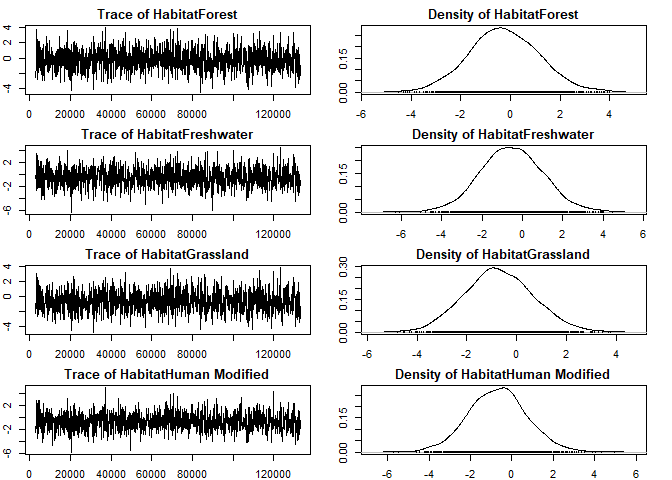

Risk mapping by climate, host trait and distribution
================
Yanjie Xu
15/03/2022

# Salmonella example

This is a report for the risk modelling using *Salmonella* as an
example. We only show the model training process here, as the model
prediction/extrapolation takes long (\~950,000 data points - 2 days).
The raw code including the full process is available at:
<https://github.com/yanjie-xu/pathogen.riskmap>.

## 1. Check the colinearity between predictors

use `vif` fuction:

``` r
vif(lmer(Npositive ~ scale(Temp)+scale(Prec)+
      scale(Clutch_MEAN)+scale(Maximum.longevity)+
      scale(Mass)+Habitat+Migration+Ntested+
        (1|animal), data=preva_trait, REML=FALSE))
```

    ##                              GVIF Df GVIF^(1/(2*Df))
    ## scale(Temp)              1.088479  1        1.043302
    ## scale(Prec)              1.075523  1        1.037074
    ## scale(Clutch_MEAN)       1.242252  1        1.114563
    ## scale(Maximum.longevity) 1.942145  1        1.393609
    ## scale(Mass)              1.515324  1        1.230985
    ## Habitat                  1.862775  5        1.064182
    ## Migration                1.373422  2        1.082558
    ## Ntested                  1.013381  1        1.006668

## 2.MCMCglmm

To enable multiple entries for single species, we define `species` as
`animal`. And define the subset birdtree as the `pedigree`.

The `animal` column should be the `Tiplabel` in birdtree instead of
scientific name.

``` r
df = preva_trait[preva_trait$Pathogen == pathogen[12],]
pathogen[12]
```

    ## [1] "Salmonella"

The model:
`model = MCMCglmm(cbind(Npositive,Ntested-Npositive) ~ scale(Temp)+scale(Prec)+                    scale(Clutch_MEAN)+scale(Maximum.longevity)+                    scale(Mass)+Migration+Habitat,                   random=~animal,                   pedigree = phy,                  family =  "multinomial2",                  data=df,                  nitt=133000,                   burnin=3000,                   thin=100)`

``` r
summary(model)
```

    ## 
    ##  Iterations = 3001:132901
    ##  Thinning interval  = 100
    ##  Sample size  = 1300 
    ## 
    ##  DIC: 7145.82 
    ## 
    ##  G-structure:  ~animal
    ## 
    ##        post.mean l-95% CI u-95% CI eff.samp
    ## animal     3.615   0.5422    7.809    299.8
    ## 
    ##  R-structure:  ~units
    ## 
    ##       post.mean l-95% CI u-95% CI eff.samp
    ## units     2.785    1.777    4.096     1300
    ## 
    ##  Location effects: cbind(Npositive, Ntested - Npositive) ~ scale(Temp) + scale(Prec) + scale(Clutch_MEAN) + scale(Maximum.longevity) + scale(Mass) + Migration + Habitat 
    ## 
    ##                           post.mean l-95% CI u-95% CI eff.samp   pMCMC    
    ## (Intercept)                -5.36566 -8.81602 -2.26305     1300 0.00308 ** 
    ## scale(Temp)                 0.89353  0.43221  1.41726     1300 < 8e-04 ***
    ## scale(Prec)                 0.20905 -0.12564  0.52075     1976 0.21846    
    ## scale(Clutch_MEAN)         -0.41312 -1.11670  0.33288     1300 0.23231    
    ## scale(Maximum.longevity)   -0.09220 -0.73404  0.50795     1537 0.79538    
    ## scale(Mass)                 0.60330  0.10430  1.03104     1446 0.01385 *  
    ## MigrationPartialMigratory   1.55723  0.17519  2.81607     1008 0.01538 *  
    ## MigrationSedentary          1.56183  0.08332  3.05943      997 0.02769 *  
    ## HabitatForest              -0.22546 -2.84277  2.48310     1300 0.86769    
    ## HabitatFreshwater          -0.52682 -3.58697  2.53493     1432 0.73846    
    ## HabitatGrassland           -0.69515 -3.25141  1.91756     1300 0.58308    
    ## HabitatHuman Modified      -0.62629 -3.43626  2.04129     1300 0.64462    
    ## HabitatMarine              -1.39958 -4.45430  2.04821     1300 0.39846    
    ## ---
    ## Signif. codes:  0 '***' 0.001 '**' 0.01 '*' 0.05 '.' 0.1 ' ' 1

Effective sample size \> 1000, OK: Your effective sample size should be
quite high aiming at 1000-2000. If not, add iterations to achieve a
comparable effective sample size. The `R structure` is the residual
structure. The `G structure` is the random effects structure.

## 3. Check model convergence

### 3.1 Check for model convergence for fixed effects

To make sure your model has converged, the trace plot should look like a
fuzzy caterpillar. Well mixed in our case, OK!

<!-- --><!-- --><!-- --><!-- -->

### 3.2 Check for model convergence for random effects

<!-- -->

Again mixed well - a little bit pattern in animal (species), OK?

### 3.3 Calculate R squared

``` r
R2(model)
```

    ## [1] 0.665
