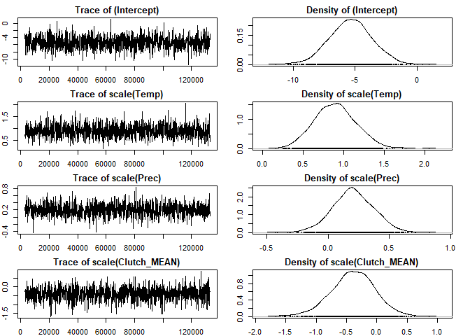
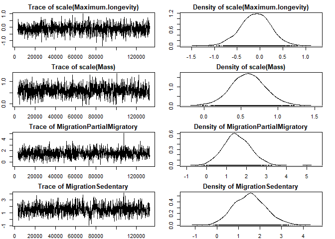

Risk mapping by climate, host trait and distribution
================
Yanjie Xu
15/03/2022

# Salmonella example

This is a report for the risk modelling using *Salmonella* as an
example. We only show the model training process here, as the model
prediction/extrapolation takes long (\~950,000 data points - 2 days).
The raw code including the full process is available at:
<https://github.com/yanjie-xu/pathogen.riskmap>.

## 1. Check the colinearity between predictors

use **vif** fuction:

``` r
vif(lmer(Npositive ~ scale(Temp)+scale(Prec)+
      scale(Clutch_MEAN)+scale(Maximum.longevity)+
      scale(Mass)+Habitat+Migration+Ntested+
        (1|animal), data=preva_trait, REML=FALSE))
```

    ##                              GVIF Df GVIF^(1/(2*Df))
    ## scale(Temp)              1.088479  1        1.043302
    ## scale(Prec)              1.075523  1        1.037074
    ## scale(Clutch_MEAN)       1.242252  1        1.114563
    ## scale(Maximum.longevity) 1.942145  1        1.393609
    ## scale(Mass)              1.515324  1        1.230985
    ## Habitat                  1.862775  5        1.064182
    ## Migration                1.373422  2        1.082558
    ## Ntested                  1.013381  1        1.006668

## 2.MCMCglmm

To enable multiple entries for single species, we define `species` as
`animal`. And define the subset birdtree as the `pedigree`.

The `animal` column should be the `Tiplabel` in birdtree instead of
scientific name.

``` r
df = preva_trait[preva_trait$Pathogen == pathogen[12],]
pathogen[12]
```

    ## [1] "Salmonella"

The model: model = MCMCglmm(cbind(Npositive,Ntested-Npositive) \~
scale(Temp)+scale(Prec)+ scale(Clutch_MEAN)+scale(Maximum.longevity)+
scale(Mass)+Migration+Habitat, random=\~animal, pedigree = phy, family =
“multinomial2”, data=df, nitt=133000, burnin=3000, thin=100)

``` r
summary(model)
```

    ## 
    ##  Iterations = 3001:132901
    ##  Thinning interval  = 100
    ##  Sample size  = 1300 
    ## 
    ##  DIC: 7145.674 
    ## 
    ##  G-structure:  ~animal
    ## 
    ##        post.mean l-95% CI u-95% CI eff.samp
    ## animal     3.658   0.4399    7.766    319.7
    ## 
    ##  R-structure:  ~units
    ## 
    ##       post.mean l-95% CI u-95% CI eff.samp
    ## units     2.815    1.664    4.068     1178
    ## 
    ##  Location effects: cbind(Npositive, Ntested - Npositive) ~ scale(Temp) + scale(Prec) + scale(Clutch_MEAN) + scale(Maximum.longevity) + scale(Mass) + Migration + Habitat 
    ## 
    ##                           post.mean l-95% CI u-95% CI eff.samp   pMCMC    
    ## (Intercept)                 -5.5320  -8.9130  -1.9955     1300 0.00154 ** 
    ## scale(Temp)                  0.8947   0.4034   1.4043     1096 < 8e-04 ***
    ## scale(Prec)                  0.1924  -0.1857   0.5072     1300 0.27077    
    ## scale(Clutch_MEAN)          -0.4316  -1.1540   0.3081     1320 0.25385    
    ## scale(Maximum.longevity)    -0.1106  -0.7365   0.5101     1300 0.75077    
    ## scale(Mass)                  0.6127   0.1337   1.0592     1196 0.00923 ** 
    ## MigrationPartialMigratory    1.6056   0.1476   2.9334     1300 0.02000 *  
    ## MigrationSedentary           1.5858   0.2684   3.0786     1037 0.02308 *  
    ## HabitatForest               -0.1623  -2.8446   2.6952     1300 0.86154    
    ## HabitatFreshwater           -0.5096  -3.6007   2.5580     1300 0.74462    
    ## HabitatGrassland            -0.6440  -3.6130   1.8203     1300 0.63538    
    ## HabitatHuman Modified       -0.5767  -3.5963   2.2458     1300 0.69231    
    ## HabitatMarine               -1.3648  -4.6519   1.7778     1300 0.42308    
    ## ---
    ## Signif. codes:  0 '***' 0.001 '**' 0.01 '*' 0.05 '.' 0.1 ' ' 1

Effective sample size \> 1000, OK: Your effective sample size should be
quite high aiming at 1000-2000. If not, add iterations to achieve a
comparable effective sample size. The `R structure` is the residual
structure. The `G structure` is the random effects structure.

## 3. Check model convergence

### 3.1 Check for model convergence for fixed effects

To make sure your model has converged, the trace plot should look like a
fuzzy caterpillar. Well mixed in our case, OK!

<!-- --><!-- --><!-- --><!-- -->

### 3.2 Check for model convergence for random effects

<!-- -->

Again mixed well - a little bit pattern in animal (species), OK?

### 3.3 Calculate R squared

``` r
R2(model)
```

    ## [1] 0.666
